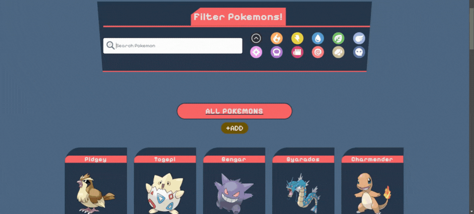
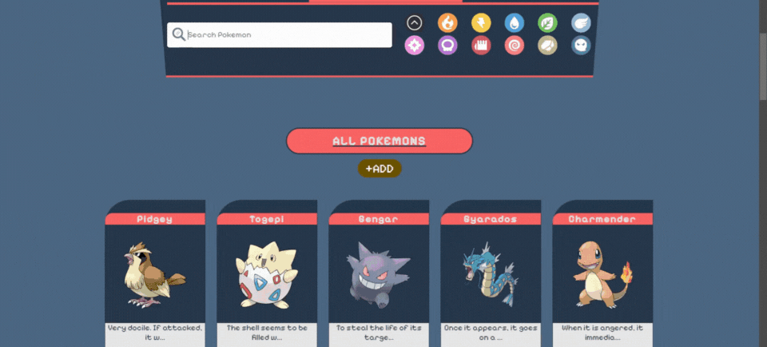
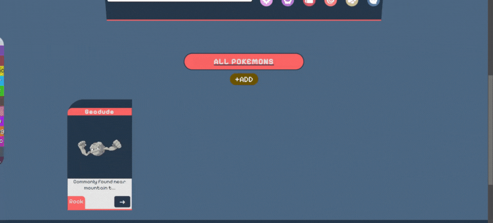

# Pokedex App With React
Pokedex app that I created with React.

I used HTML, CSS, Javascript, Framer-Motion, React, Firebase and React-Router-Dom as programming languages and libraries within the project. Filter Pokemons by category or typing their name. After clicking on the detailss button, you can update or delete the selected Pokémon. Additionally, you can add your own customized Pokemon upon request.

The project is live and you can see see it by visiting https://pokedex-app-with-react.web.app/

## Table of Contents
- [Installation](#installation)
- [Usage](#usage)
- [Contributing](#contributing)
- [Overview](#overview)

## Installation

To install and run the application locally, follow these steps:

1. Clone this repository to your local machine.
2. Navigate to the project directory.
3. Run `npm install` to install the necessary dependencies.
4. Run `npm run dev` to start the development server.
5. Open your web browser and visit `http://localhost:5173` to see the application.

## Usage

Once the application is running, you can perform the following actions:

1. Add or delete Pokemons.
2. Filter Pokemons by category or typing their name.
3. Click details to see other options.
4. Customize a Pokemon by using update method.

## Contributing

Contributions are welcome! If you would like to contribute to this project, please follow these steps:

1. Fork the repository.
2. Create a new branch for your feature or bug fix.
3. Make your changes and commit them.
4. Push your changes to your fork.
5. Submit a pull request describing your changes.

## Overview

-Main page  
   

-Filter by Category or Name  
   

-Add Pokemon  
   

-Detail Page ,Update and Delete  
   
